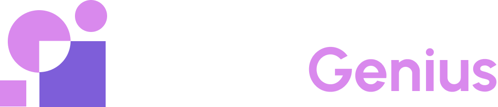
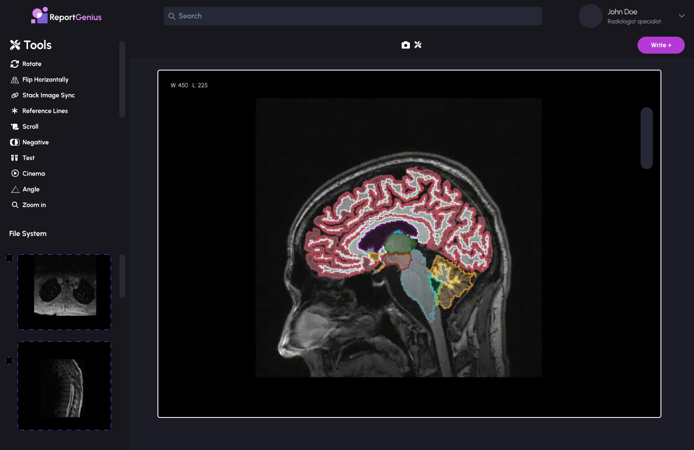
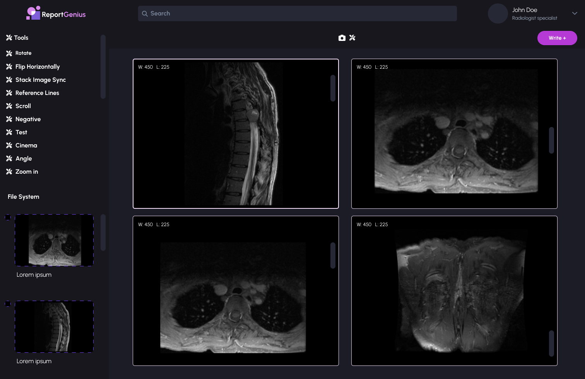

# **Report Genius**

We are Report Genius, an AI startup streamlining radiology reporting. Our technology automates the generation of radiological reports using advanced image segmentation and expert annotations. By eliminating manual processes, we save time for radiologists and improve accuracy. Additionally, we provide an automatic question and answering service, empowering patients with quick access to essential healthcare information. With our innovative solution, we simplify radiology workflows and enhance patient care, making diagnoses faster, more reliable, and accessible to all.

# **About**
To learn more about our startup you can visit our presentation video:

 

# **Technical Overview**
## High-level Architecture

[Add image]

## Frontend
- To develop these views:

&nbsp;&nbsp;&nbsp;&nbsp;&nbsp;&nbsp;&nbsp;

we will develop the UI with the <a target="_blank" href="https://react.dev/">ReactJS</a> library because it brings a strong manipulation of the DOM and recycling of components.

- In addition to this library we will use <a target="_blank" href="https://www.typescriptlang.org/">TypeScript</a> because it brings the type safety.

## Backend
### WebServer
- We will use <a target="_blank" href="https://nodejs.org/en">NodeJS</a> for the backend language and the <a target="_blank" href="https://expressjs.com/">ExpressJS</a> library to create a RESTful API.

### ML API
- The segmentation algorithms for the organs will be outsourced from the project Total Segmentator
- The report generating functionalities will be backed by chatgpt 

### Dicom Listener
- This will consist in a dicom server that accepts the exams from the Orthanc PACS

### Orthanc
- This will be our local PACS server and will work as a cache for medical images, so that our application does not need to query and retrieve the hospital's pacs.

### Integration with HL7 and FHIR
This will be an specific service in charge of connecting to hl7 and fhir.

## Database
- For our main database we will use <a target="_blank" href="https://www.mysql.com/">MySQL</a> because we will store structured data.
- Also we will have a <a target="_blank" href="https://redis.io//">Redis</a> db implemented on our main server to cache the data.
